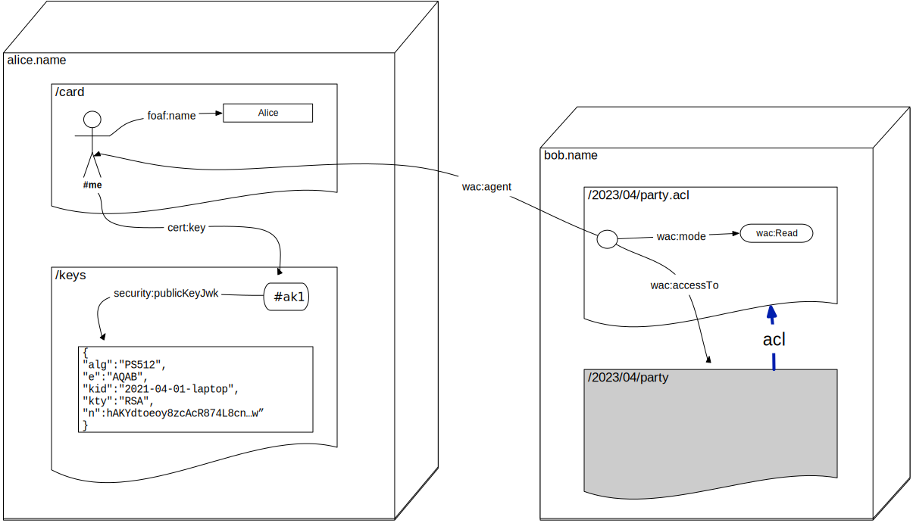

# Basic Use cases 

This is the basic use cases given in the [HttpSig protocol](https://github.com/solid/authentication-panel/pull/235). We essentially built from identifying a user via a public key, and move to a slight indirection of a WebID to
simplify the maintenance of access control rules and make them more flexible.

- [Basic Use cases](#basic-use-cases)
  - [Description of the Agent using `did:key`](#description-of-the-agent-using-didkey)
  - [Direct Description of Agent via Key Reference in the ACL file](#direct-description-of-agent-via-key-reference-in-the-acl-file)
  - [Description of Agent via Key Reference](#description-of-agent-via-key-reference)
    - [Client reasoning](#client-reasoning)
    - [Server Reasoning](#server-reasoning)
- [One-step indirection: WebID](#one-step-indirection-webid)
    - [Client Auth logic](#client-auth-logic)
    - [Server Auth logic](#server-auth-logic)


## Description of the Agent using `did:key`

The simplest way of tying an agent to a key would be using a [did:key](https://w3c-ccg.github.io/did-method-key/) keyid. 
This can also easily be illustrated in this diagram which gives access to `_:alice` referred to via her public key.

The WAC resource `</2023/04/party.acl>` in the illustration contain the following graph:

```turtle
@prefix : <http://www.w3.org/ns/auth/acl#> .
@prefix cert: <http://www.w3.org/ns/auth/cert#> .

[] a :Authrization;
   :mode :Read;
   :agent [ a foaf:Agent;
           cert:key <did:key:z6Mk...> ].
   :accessTo </2023/04/party> .
```

The logic of the signing and verification is very simple to follow: 

Signature:
 1. the resource `</2023/04/party>` returns a 401 linked to the WAC resource via the `Link: <party.acl>; rel=acl` header allowing the client to find if it controls that key.
 2. The client uses that key to sign the headers using the `did:key` as a keyId.

 Verification:
 1. the server receives the signed request and verifies the signature
 2. the Guard then checks that the request made is in the right mode for the given resource


This would require the wallet to be able to parse `did:key` keyIDs.
The client could indeed sign with an `https` URLs as `keyId`s but that would just make the work on the server more complex, by requiring it to fetch that key for no particular benefit.

 ## Direct Description of Agent via Key Reference in the ACL file

While we wait for `did:key` parsers to be more widely available, we can use an `https` URL reference for the key.

Here is the equivalent to our previous example, but with having replaced the `did:key` with its JWK representation.
(todo: the keys are not the same in the example) 

```Turtle
@prefix : <http://www.w3.org/ns/auth/acl#> .
@prefix security: <https://w3id.org/security#> .
@prefix cert: <http://www.w3.org/ns/auth/cert#> .

<#r1> a :Authorization;
  :mode :Write, :Read;
  :agent [ a foaf:Agent;
           cert:key <#k1> ].
  :accessTo </2023/04/party> .     

<#k1> security:publicKeyJwk """{
    "alg":"PS512",
    "e":"AQAB",
    "kid":"2021-04-01-laptop",
    "kty":"RSA",
    "n":hAKYdtoeoy8zcAcR874L8cnZxKzAGwd7v36APp7Pv6Q2jdsPBRrwWEBnez6d0UDKDwGbc6nxfEXAy5mbhgajzrw3MOEt8uA5txSKobBpKDeBLOsdJKFqMGmXCQvEG7YemcxDTRPxAleIAgYYRjTSd_QBwVW9OwNFhekro3RtlinV0a75jfZgkne_YiktSvLG34lw2zqXBDTC5NHROUqGTlML4PlNZS5Ri2U4aCNx2rUPRcKIlE0PuKxI4T-HIaFpv8-rdV6eUgOrB2xeI1dSFFn_nnv5OoZJEIB-VmuKn3DCUcCZSFlQPSXSfBDiUGhwOw76WuSSsf1D4b_vLoJ10w"
  }"""^^rdfs:JSON
```

The complexity in the representation here comes from having to use the security vocab that uses [JWK](https://www.rfc-editor.org/rfc/rfc7517) literal to describe a key. The [`security` vocabulary](https://w3c.github.io/vc-data-integrity/vocab/security/vocabulary.html) has the relation `security:controller` linking a key to an agent that controls the key, but we need the inverse relation. I chose the `cert:key` relation for the moment until a better answer is available. 

Two issues for the security vocabulary:
 * [issue 73: domain of publicKeyJWK should be rdf:JSON](https://github.com/w3c/vc-data-integrity/issues/73)
 * [issue 74: Domain and range of sec:publicKey](https://github.com/w3c/vc-data-integrity/issues/74)


## Description of Agent via Key Reference

The problem with the [previous use cases](#simplest-access-control-list-examples) is that the  WAC file has to maintain the public key of the agent being given access. This may be ok for a single-user system, but in a distributed system where we may want to give read or write access to a few agents, each of which has their own Personal Online DataStore (POD), then maintaining someone else keys is going to be too much work and too brittle, as one of the agents may find their key is compromised, may want to change it, and will then need to request update of all the keys in all access control rules on all servers that gave that agent access.

So let's say Alice wants to give Bob access to `https://bob.name/2023/04/party`. She could write the following access control rule for that directory:

```Turtle
<#r1> a :Authorization;
  :mode :Read;
  :agent [ cert:key <https://alice.name/keys#ak1> ];
  :agent [ cert:key </keys#bk1> ];
  :default <.> .  
```

The above gives Read access to Alice and Bob, via their keys, but
those keys can be maintained by their respective controllers (owners, Principals?).

Alice's key `</keys#ak1>` could then contain the following graph:

```Turtle
<#> security:controller </card#me> ;
    security:publicKeyJwk """{
            "alg":"PS512",
            "e":"AQAB",
            "kid":"2021-04-01-laptop",
            "kty":"RSA",
            "n":hAKYdtoeoy8zcAcR874L8cnZxKzAGwd7v36APp7Pv6Q2jdsPBRrwWEBnez6d0UDKDwGbc6nxfEXAy5mbhgajzrw3MOEt8uA5txSKobBpKDeBLOsdJKFqMGmXCQvEG7YemcxDTRPxAleIAgYYRjTSd_QBwVW9OwNFhekro3RtlinV0a75jfZgkne_YiktSvLG34lw2zqXBDTC5NHROUqGTlML4PlNZS5Ri2U4aCNx2rUPRcKIlE0PuKxI4T-HIaFpv8-rdV6eUgOrB2xeI1dSFFn_nnv5OoZJEIB-VmuKn3DCUcCZSFlQPSXSfBDiUGhwOw76WuSSsf1D4b_vLoJ10w"
     }"""^^rdf:JSON
```      

Bob would of course have a similar file on his POD. 

### Client reasoning

The way Alice's client is meant to reason is as follows:

1. it follows the `acl` link from the 401-ed `R`` resource to `ACL` = `</2023/04/party.acl>`
2. after fetching ACL it finds the rules that apply to the resource `R` in the needed mode
3. the client looks if it is an agent listed as being allowed: in this case by checking if one of the client's keys is listed.  Here it only needs to recognize that `<https://bob.name/keys#bk1>` is one of its keys. 
4. It can use HttpSig to sign the headers with the keys and pass the `keyId` in the `Signature-Input` header

### Server Reasoning

Bob's Server receiving the signed header on the resource `R` with the keyId needs to verify that the agent making the request is authorized. So after checking the signature, by `GET`-ing the `keyId` URL, and verifying that header was signed with the private key corresponding to the public key at that location, the Guard on Bob's Server will know that the request is from agent `_:X` 

```Turtle
_:X a foaf:Agent;
   cert:key <https://alice.name/keys#ak1> .
```

and that `_:X` is authorized according to the rules for `R` in the given mode.

But that `_:X` is to be found in the rule allowing Alice access in read mode for `R`, and so there is nothing more to do at that point. 

Q: does it require that `cert:key` be an `owl:InverseFunctionalProperty` so that the blank node in the rule can be identified indirectly via the `cert:key` relation? (As it happens [cert:key](https://www.w3.org/ns/auth/cert#key) is an inverse functional property) 

# One-step indirection: WebID 

One problem with identifying individuals with keys is that people can have a number of them, and those keys can change over time for several reasons: people can lose their corresponding private key, find that one of their keys was compromised, or just move to safer algorithms. Furthermore, a person may have other methods of authentication such as OpenId, OAuth, ... that they may like to use on different occasions. They may even want to use telephone verification or email verification in some cases.
The person who is giving access to a resource may not care that much how the person authenticating is doing that, and they will very often not want to have to maintain that list. What they most often want is to allow some agent access. This is what WebID allows.

Let us look at a slightly more complex example where the rule specifies access by WebID and the client authenticates with a key using HttpSig. This diagram should make it easy to follow what is going on. We suppose Alice has an app that wants to read Bob's party info but that requires authentication to see (hence it is grayed out). Alice can read it according to the rule. So she uses here `</key#k1>` to authenticate using HttpSig. 



The rule identifies Alice as being able to access via WebID.

```Turtle
<#r1> a :Authorization;
  :mode :Read;
  :agent <https://alice.name/card#me>;
  :agent <https://www.w3.org/People/Berners-Lee/card#i>
  :default <.> .  
```

Alice's WebID document at `<https://alice.name/card>` contains a link to an OpenID and a key, which is published in another linked document 
   
```Turtle
<#me> a foaf:Person;
   foaf:openid </>;
   cert:key </keys#k1> .
```

### Client Auth logic

The client on seeing the rule `<https://bob.name/2023/04/party>`
needs to first find out if one of those WebIDs refers to its Principal. If yes, then it must find which `WWW-Authenticate` methods it can use. So if the server states `WWW-Authenticate: HttpSig` and the WebId contains a link to the public key, then the client can use HttpSig.

But now we have a problem: the client needs to let the server know that the key is tied to that WebId. There are several scenarios.

1. The WebID doc links to the key in the same document
   ```Turtle
   <#me> cert:key <#k> .
   <#k> security:publicKeyJwk ... 
   ```
2. The WebID doc links to the key in another doc as shown above
   ```Turtle
   <#me> cert:key </keys#k1> .
   ```

In both those case, but especially the second, after signing the header with the key, the client should also tell the server where the WebID is relative to the key, or which WebID is intended to be used. After all the same key could be used for several different WebIDs - though that would result in those WebIDs being inferrable as `owl:sameAs` each other. 

So let us take the difficult case of the second scenario, where the key does not link to the WebID and is in a different document. The KeyID Document would contain the following:

```Turtle
<#k1> security:publicKeyJwk "...". 
```

It could link to the WebID with 

```Turtle
<#k1> security:controller <https://alice.name/card#me> .
```

But that would not be proof that this key is the key of the given WebId because anyone could create a key and link it to any WebId. So the WebId document would need to link back to the key. 

If the client signs the header with the `keyId` `<#k1>` then the client will need to tell the Guard to which WebId that key is linked. So the client will need to add a header to the request to tell the server where to find the WebId.  One proposal would be to add a field to the `Authorization` header as a property. (Note that because those properties are comma separated this means that there can only be one Authorization header per request)

```HTTP
GET /comments/ HTTP/1.1
Authorization: HttpSig proof=sig1, webid="/people/henry/card#me"
Accept: text/turtle, application/ld+json;q=0.9, */*;q=0.8
Signature-Input: sig1=("@request-target" "authorization");keyid="/keys#k";\
    created=1617265800;expires=1617320700
Signature: sig1=:jnwCuSDVKd8royZnKgm0GBQzLcad4ynATDIrkNkQGHGY6Dd0ftc0MKX88fZwek\
    KevNW4N5eky+idEqOsvj+wpxc7xXN7KwnAT0SzGjyj+3CxnVN26er72l1zWDRBxo7IN3raKi0wE\
    Oxv7mW2Ms9/VQ4gChyTK+n2zUz+nuly/6cKlJDwqsbb6MDFq88p6OYjx3AFwqlgJvQ5U1RCkZzI\
    1X6P98pE0oY8Z8xu5dtyCwVBVyLXkAdeVlCABA3jdZB/qorSmbEgoQBXVvLsNaVAkAnIGY6sEFv\
    j0FZ/90URJSeraJLrHmOhOIwL5T11mIdhmlqLCk4werRFfbfRBTBQ9g==:
```

### Server Auth logic

The server on receiving the above-signed request will be able to prove that the client has access to the private key `</keys#k1>` but how will it know that is the key of the WebID? That requires the WebID to link to the key or to link to a proof of the relation between the key and the WebID, something like a signature of some text.  

The Guard has to reason from the rules of the ACL file that match the request. Using Authorization `#r1` [above](#one-step-indirection-webid) it will be able to select the WebId specified in the header and check that it is listed either as the object of `:agent` or as a member of `:agentGroup`, or perhaps as satisfying a description in `:agentClass`. 

As the WebID is a URL (here `https://alice.name/card#me`) the Guard is entitled to fetch that resource, since it is referred to in the rule. And from there it will want to find a link from the WebID to the key that signed the document. 

So the Guard can jump from the WebID in the rule doc to the definition of the WebID in the profile doc. And from there it can follow a link like `cert:key` to the keyId. If the keyId is the one it used to authenticate the request then the job is done.

